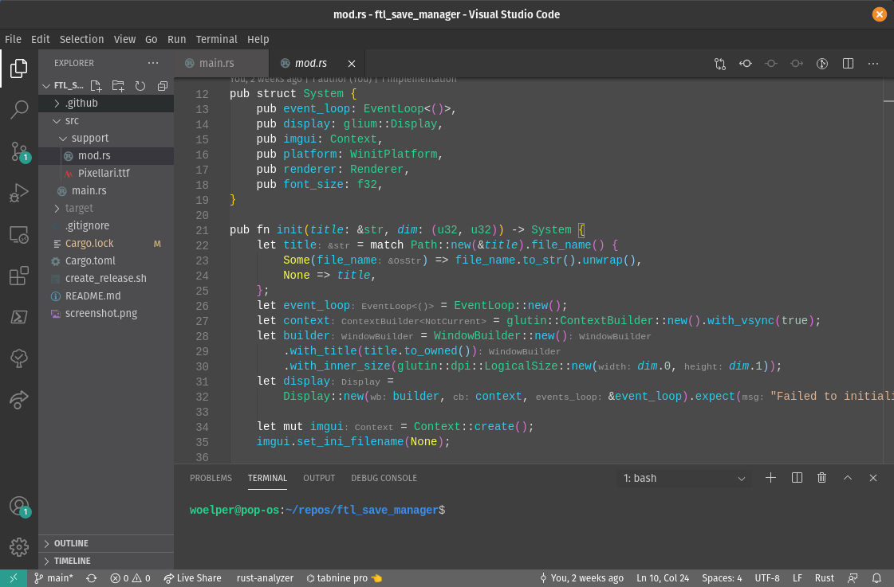

# Lupus theme for VS Code

_A grey color theme which is easy on the eyes._

There are a lot of light or dark themes out there, but I have searched quite some time for a readable, balanced grey one.

This is an attempt to carefully balance colors to be readable and reduce eye strain. Colors are selected to match throughout the theme and are harmonic whereever possible. The number of different colors is intentionally low, as many people have additional color information from other extensions, such as rainbow tags or bracket pair colorizer.

Enjoy!

